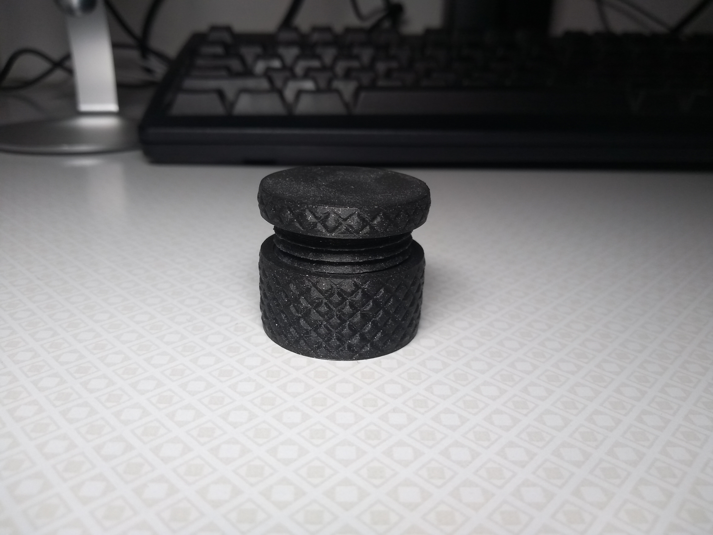

# Screw Pad

## About

I once needed to drill into a rather large aluminium plate using a very small drill press. To do that, I needed to prop up the three corners of the plate that didn't fit on the drill press table. That's when the idea for the screw pad was born: A finely adjustable support for light workshop duties.

For a while, I planned to sell this as a product. Not because I though it would be successful, I have no indication that anyone ever needed this, except for me, that one time, but because it seemed like a simple enough product to design and manufacture, and I wanted to learn about the logistics of selling physical products online.

My product ideas have since taken [a different turn](https://github.com/hannobraun/notebook), so I decided to just make this repository public and leave it be.

## Ideas

I've had two ideas for further development of this product.

### Sideways access using screw driver

During my testing, it became obvious that adjusting the Screw Pad was pretty difficult. The Screw Pad is pretty low, so if you put it under something, it can be hard to fit your hand in there to get to it.

I had this idea of using a worm gear mechanism to allow for adjusting the Screw Pad with a screw driver from the side. The problem with this is that it could take pretty long to adjust, and the worm gear is not backdrivable, so you can no longer just spin the top.

Maybe there's a decent idea in there somewhere, I don't know.

### Range extension through telescopic mechanism

Another problem is that the adjustable height range is relatively narrow. A factor of two is the upper limit for the length ratio between the fully contracted and the fully extended states.

I figured that maybe this could be addressed using a [multi-stage telescopic screw actuator](https://www.youtube.com/watch?v=nmyvMkfxtbo), but never got as far as designing that.

## License

This product is open source, licensed under the terms of the [Zero Clause BSD License] (0BSD, for short). This basically means you can do anything with it, without any restrictions, but you can't hold the authors liable for problems.

See [LICENSE.md] for full details.

[Zero Clause BSD License]: https://opensource.org/licenses/0BSD
[LICENSE.md]: LICENSE.md
